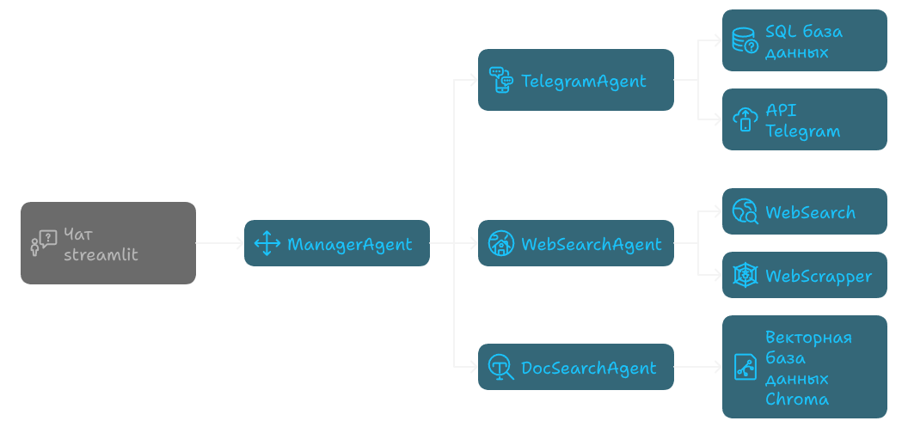

 

  <!--  -->

  <h3 align="center">TELEGRAM AGENT 
      
    
    multiagent system
    
  </h3>

  <!-- 

    A README template to jumpstart your projects!
     
    <a href="https://github.com/catiaspsilva/README-template/blob/main/images/docs.txt"><strong>Explore the docs »</strong></a>
      
     
    <a href="#usage">View Demo</a>
    ·
    <a href="https://github.com/catiaspsilva/README-template/issues">Report Bug</a>
    ·
    <a href="https://github.com/catiaspsilva/README-template/issues">Request Feature</a>
  
 -->

## О проекте

Проект представляет собой мультиагентную систему на базе фреймворка `LangChain`, которая позволяет искать и анализировать информацию из различных источников — Telegram-чатов, веб-страниц, локальных документов (PDF, PPTX). Для пользователя предусмотрена единая точка входа через менеджера-агента, который автоматически выбирает оптимальные инструменты и агентов для решения задачи, используя современные методы обработки текста, базы данных и векторные хранилища.

## 🛠 Технологии

## Схема системы

## Описание системы
* Менеджер-агент (manager.py):
Центральный компонент, который принимает запрос пользователя и распределяет его между специализированными агентами (Telegram, Web, DocSearch) в зависимости от типа задачи.

* Агент Telegram (telegram/telegram_chat_agent.py):
Отвечает за обработку пользовательских запросов, связанных с Telegram-чатами. Определяет, какие чаты и за какой период нужно анализировать, извлекает сообщения, формирует ответы, поддерживает суммаризацию и семантический поиск по переписке.

* Оператор работы с Telegram и базой данных (telegram/telegram_scrapper.py):
Выполняет сбор новых сообщений из Telegram-чатов с помощью Telethon, сохраняет их в базу данных, обеспечивает синхронизацию, обработку и обновление статусов сообщений. 

* Агент веб-поиска (websearch/web_chat_agent.py, ):
Позволяет искать факты и информацию в интернете.
Использует DuckDuckGo для поиска ссылок и собственный скраппер для извлечения данных с найденных страниц.

* WebScrapper (websearch/web_scrapper.py)
Инструмент для извлечения фактической информации с веб-страниц. Получает ссылки от агента веб-поиска, скачивает и парсит содержимое страниц, возвращает структурированные данные для формирования ответа пользователю.

* Агент поиска по PDF-файлам (docsearch/docsearch_chat_agent.py):
Осуществляет поиск и ответы на вопросы по локальным документам (PDF, PPTX).
Индексирует документы во векторное хранилище и отвечает на вопросы с указанием источников.

* Векторные базы данных
Хранят эмбеддинги сообщений и документов для семантического поиска.

* Файлы конфигурации (config/tgChats.yaml, .env):
Содержит список Telegram-чатов, с которыми работает система в формате YAML. 

